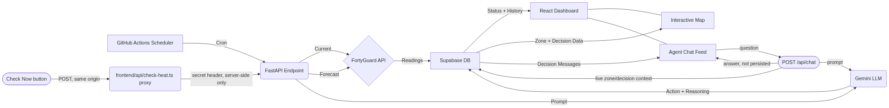

# Swelter

An autonomous AI agent that monitors hyperlocal heat risk and maintains OSHA compliance records for small construction and landscaping contractors. Built solo for FortyGuard's Hackathon'26.

## Problem

Small contractors manage heat safety manually by checking weather apps, creating inconsistency, lack of documentation, and liability exposure. Existing tools are either informational-only, paperwork-only, or enterprise-priced hardware platforms.

## Solution

Swelter is a hardware-free agent that:
1. Polls the FortyGuard Temperature API for custom watch zones
2. Uses AI reasoning (Gemini LLM) to assess risk and decide actions
3. Surfaces its decisions through an in-app agent chat feed and logs every decision to Supabase
4. Runs autonomously on a GitHub Actions schedule
5. Visualizes every zone on an interactive map, color-coded by current risk level

This provides small contractors enterprise-grade protection and audit trails at an accessible price.

## How it Works

1. GitHub Actions cron triggers the `/api/check-heat` endpoint
2. FastAPI fetches current and forecast readings from FortyGuard
3. Readings are saved to Supabase
4. FastAPI prompts Gemini with readings + previous decisions
5. Gemini returns a reasoned action (none, alert, reschedule, escalate) with plain-language reasoning
6. The decision is logged to Supabase
7. The website's agent chat feed and interactive map both render straight from that same
   decision data — no external notification service involved
8. A manual "Check Now" button POSTs to a small Vercel serverless proxy (`frontend/api/check-heat.ts`)
   that holds the check-heat secret server-side and forwards the trigger to the backend, so the
   secret never ships in the frontend bundle
9. The chat feed also accepts typed questions (`POST /api/chat`) — the agent answers using the
   same live zone/decision data, without writing a new autonomous decision

## Tech Stack
- Frontend: React (Vite)
- Backend: FastAPI (Vercel serverless)
- Database: Supabase Postgres
- Scheduler: GitHub Actions
- LLM: Gemini API
- Mapping: react-leaflet + OpenStreetMap (Mapbox was planned but skipped — no signup/token needed)

## Repo Structure
- `backend/` - FastAPI endpoints
- `frontend/` - React frontend
- `db/` - Supabase migrations
- `.github/workflows/` - GitHub Actions cron

## Local Setup
1. Clone repo
2. Copy `.env.example` to `.env` and populate keys (Supabase, FortyGuard, Gemini, agent secret)
3. Run `npm install` in `frontend/`
4. Run `cd backend && uvicorn main:app --reload`
5. Run `npm run dev` in `frontend/` (or `npx vercel dev` to also exercise `frontend/api/check-heat.ts`
   locally — plain `npm run dev` doesn't execute serverless functions, see decisions.md)

<!-- ## License
MIT -->

## Contact
Built by @bilalnadeem614 for FortyGuard Hackathon'26. Questions? Email bilalnadeem883@gmail.com.